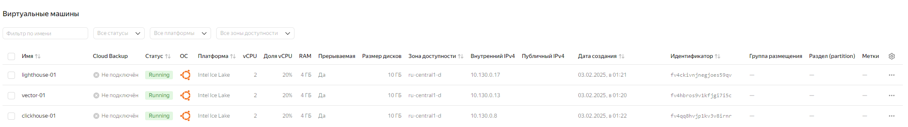
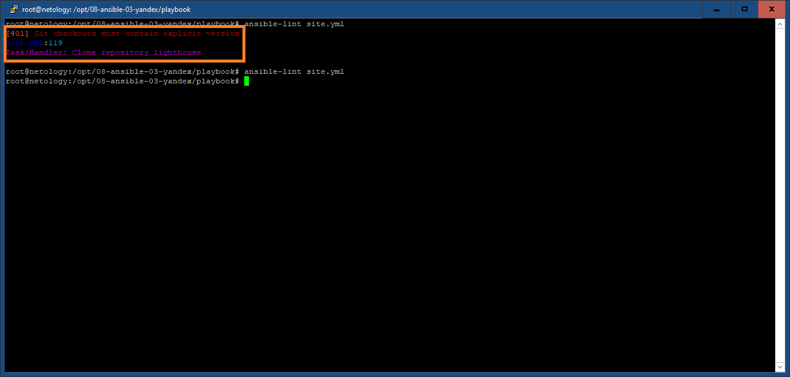
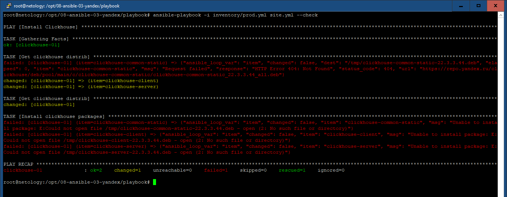
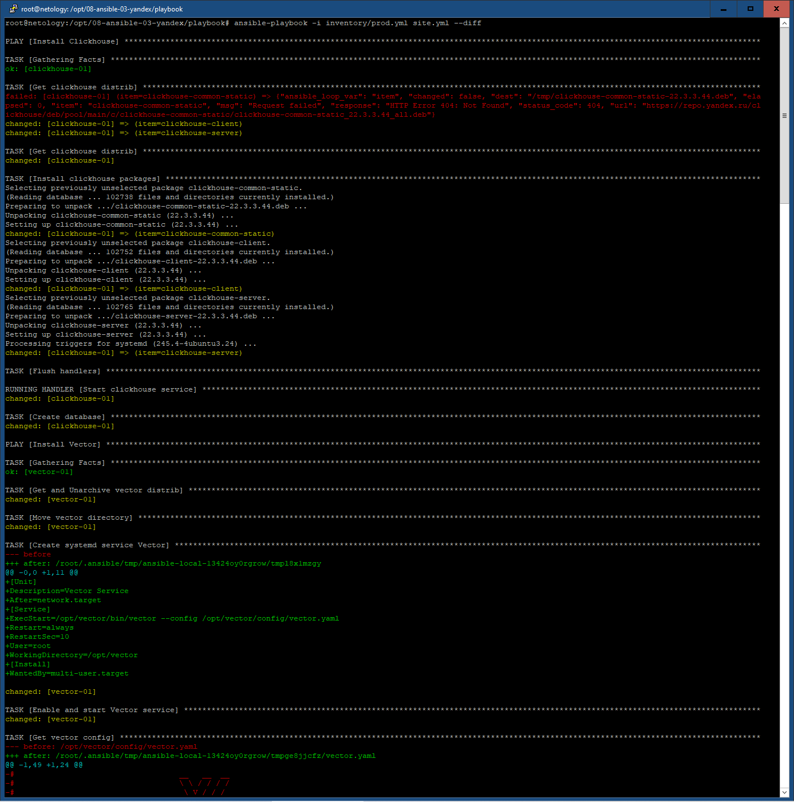
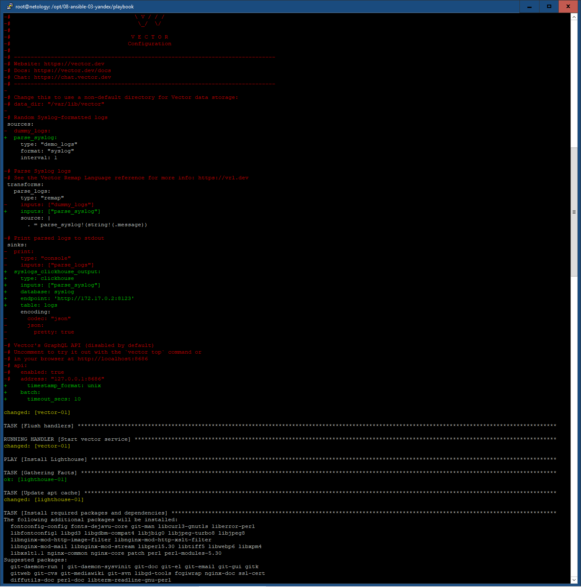
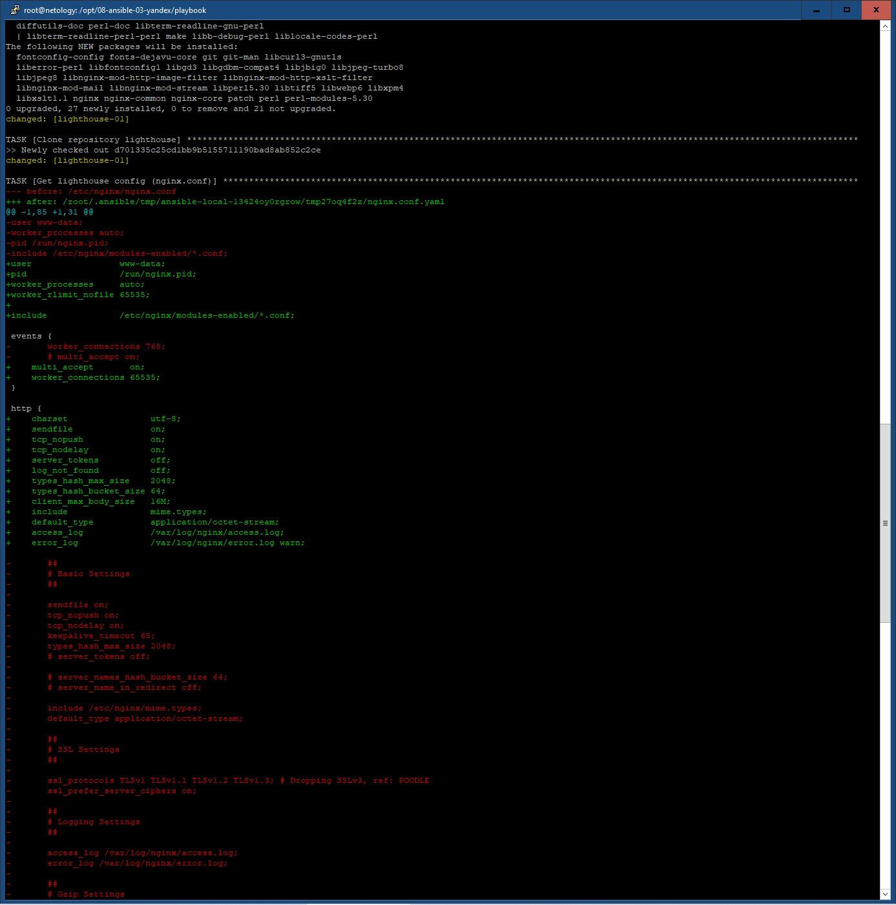
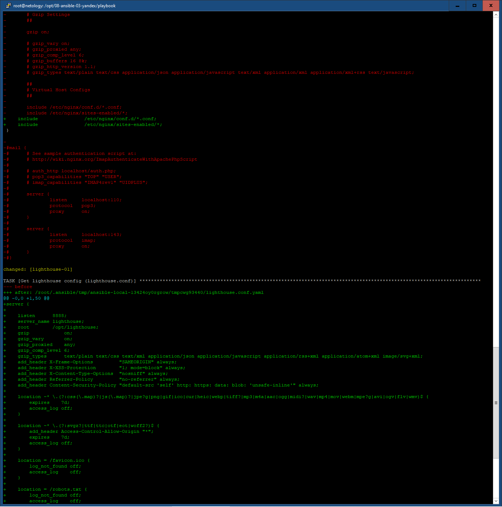
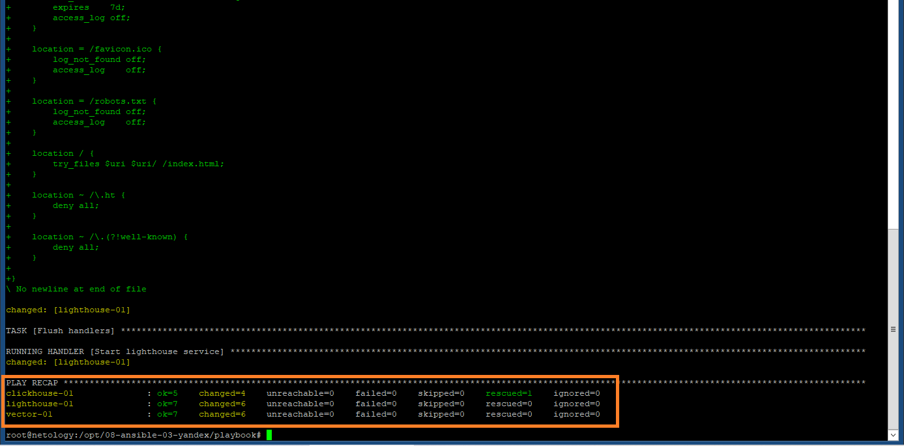
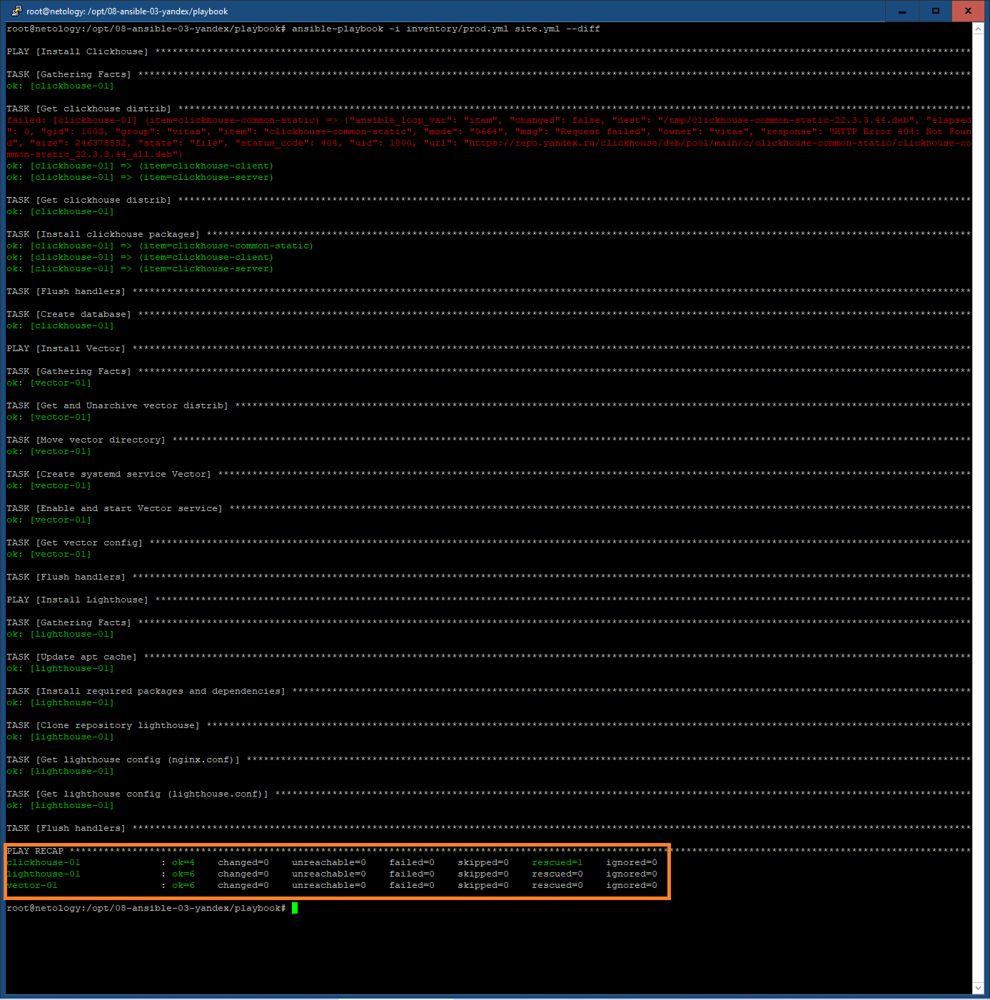

# 08-ansible-03-yandex

## Подготовка к выполнению

В задании участвуют 3 виртуальные машины (clickhouse, vector, lighthouse) с установленной ОС Ubuntu 20.04



## Основная часть

Заполняем в ./playbook/inventory/prod.yml соответствующие значения ansible_host IP виртуальных машин, проверяем
корректность заполнения порта ssh (по умолчанию 22), а также имя пользователя c правами root и ссылку закрытый ключ:

``` yaml
clickhouse:
  hosts:
    clickhouse-01:
      ansible_host: 51.250.112.86
      ansible_port: 22
      ansible_user: vitas
      ansible_ssh_private_key_file: "~/.ssh/id_yc_ed25519"
vector:
  hosts:
    vector-01:
      ansible_host: 51.250.114.74
      ansible_port: 22
      ansible_user: vitas
      ansible_ssh_private_key_file: "~/.ssh/id_yc_ed25519"
lighthouse:
  hosts:
    lighthouse-01:
      ansible_host: 51.250.114.92
      ansible_port: 22
      ansible_user: vitas
      ansible_ssh_private_key_file: "~/.ssh/id_yc_ed25519"
```

Переменные vars.yaml из Group_vars состоят из групп: Clickhouse, Vector и Lighthouse. Содержат информацию о приложениях, версиях и платформах
для установки, ссылок на репозитарии, некоторые настройки web:

clickhouse:

``` ansible
clickhouse_version: "22.3.3.44"
clickhouse_packages:
  - clickhouse-client
  - clickhouse-server
  - clickhouse-common-static
```

vector:

``` ansible
vector_version: "0.44.0"
vector_platform: "x86_64"
vector_directory: "/opt"
vector_clickhouse_ip: "172.17.0.2"
```

lighthouse:

``` ansible
lighthouse_repository: "https://github.com/VKCOM/lighthouse.git"
lighthouse_web_user: "www-data"
lighthouse_web_port: "8888"
```

Playbook site.yml состоит из 3-х play: Install Clickhouse, Install Vector и Install Lighthouse.

Install Clickhouse состоит из task:

- Загрузка дистрибутивов из репозитория https://repo.yandex.ru/clickhouse:

``` ansible
    - block:
        - name: Get clickhouse distrib
          ansible.builtin.get_url:
            url: "https://repo.yandex.ru/clickhouse/deb/pool/main/c/{{ item }}/{{ item }}_{{ clickhouse_version }}_all.deb"
            dest: "/tmp/{{ item }}-{{ clickhouse_version }}.deb"
          with_items: "{{ clickhouse_packages }}"
      rescue:
        - name: Get clickhouse distrib
          ansible.builtin.get_url:
            url: "https://repo.yandex.ru/clickhouse/deb/pool/main/c/clickhouse-common-static/clickhouse-common-static_{{ clickhouse_version }}_amd64.deb"
            dest: "/tmp/clickhouse-common-static-{{ clickhouse_version }}.deb"
```

- Установка пакетов:

``` ansible
    - block:
        - name: Install clickhouse packages
          become: true
          apt:
            deb: /tmp/{{ item }}-{{ clickhouse_version }}.deb
          environment:
            DEBIAN_FRONTEND: noninteractive
          with_items: "{{ clickhouse_packages }}"
          notify: Start lighthouse service
```

- Создание БД:

``` ansible
    - name: Create database
      ansible.builtin.command: "clickhouse-client -q 'create database logs;'"
      register: create_db
      failed_when: create_db.rc != 0 and create_db.rc !=82
      changed_when: create_db.rc == 0
```

Install Vector состоит из task:

- Загрузка, распаковка дистрибутива Vector:

``` ansible
    - name: Get and Unarchive vector distrib
      become: true
      ansible.builtin.unarchive:
        remote_src: yes
        src: "https://packages.timber.io/vector/{{ vector_version }}/vector-{{ vector_version }}-{{ vector_platform }}-unknown-linux-gnu.tar.gz"
        dest: "{{ vector_directory }}"
    - name: Move vector directory
      become: true
      command: "mv {{ vector_directory }}/vector-{{ vector_platform }}-unknown-linux-gnu {{ vector_directory }}/vector"
      args:
        creates: "{{ vector_directory }}/vector"
```

- Создания systemd сервиса Vector, ее активация и автозапуск.

``` ansible
    - name: Create systemd service Vector
      become: true
      copy:
        dest: /etc/systemd/system/vector.service
        content: |
          [Unit]
          Description=Vector Service
          After=network.target
          [Service]
          ExecStart={{ vector_directory }}/vector/bin/vector --config {{ vector_directory }}/vector/config/vector.yaml
          Restart=always
          RestartSec=10
          User=root
          WorkingDirectory={{ vector_directory }}/vector
          [Install]
          WantedBy=multi-user.target
    - name: Enable and start Vector service
      become: true
      systemd:
        name: vector.service
        enabled: yes
        state: started
        daemon_reload: yes
```
, используются templates vector.yaml:

```
sources:
  parse_syslog:
    type: "demo_logs"
    format: "syslog"
    interval: 1

transforms:
  parse_logs:
    type: "remap"
    inputs: ["parse_syslog"]
    source: |
      . = parse_syslog!(string!(.message))

sinks:
  syslogs_clickhouse_output:
    type: clickhouse
    inputs: ["parse_syslog"]
    database: syslog
    endpoint: 'http://{{ clickhouse_ip }}:8123'
    table: logs
    encoding:
      timestamp_format: unix
    batch:
      timeout_secs: 10
```

Определен TAG "restart_vector", с которым можно отдельно запускать playbook для быстрого перезапуска
процесса vector, к примеру, после изменения конфигурации.

Install Lighthouse состоит из pre_tasks, который предварительно устанавливает git и nginx, и из 
следующих task:

- Загрузка из репозитория :

``` ansible
    - name: Clone repository lighthouse
      become: true
      git:
        repo: "{{ lighthouse_repository }}"
        dest: /opt/lighthouse
```

- Создания конфигурации web-сервера nginx на основе template:

``` ansible
    - name: Get lighthouse config (nginx.conf)
      become: true
      vars:
        web_user: "{{ lighthouse_web_user }}"
      template:
        src=./roles/lighthouse/templates/nginx.conf.yaml
        dest="/etc/nginx/nginx.conf"
      notify: Start lighthouse service
      tags:
        - restart_lighthouse
    - name: Get lighthouse config (lighthouse.conf)
      become: true
      vars:
        web_port: "{{ lighthouse_web_port }}"
      template:
        src=./roles/lighthouse/templates/lighthouse.conf.yaml
        dest="/etc/nginx/sites-enabled/lighthouse.conf"
      notify: Start lighthouse service
      tags:
        - restart_lighthouse
```

Пользователь nginx, а также порт для доступа к lighthouse определяются
в group_vars переменными lighthouse_web_user и lighthouse_web_port.

Определен TAG "restart_lighthouse", с которым можно отдельно запускать playbook для быстрого перезапуска
процесса lighthouse, к примеру, после изменения конфигурации nginx.

Проверка на ошибки:

``` bash
ansible-lint site.yml
```


предупреждение о необходимости указания версии в Git. 

После добавления версии ошибок нет
``` ansible
    - name: Clone repository lighthouse
      become: true
      git:
        repo: "{{ lighthouse_repository }}"
        dest: /opt/lighthouse
        version: master
```

С флагом --check

``` bash
ansible-playbook -i inventory/prod.yml site.yml --check
```


Выводит две категории ошибок:
- clickhouse-common-static не найден в репозитории в основном цикле task Get clickhouse distrib
  (найден в ветке rescue)
- не найдены clickhouse-common-static-22.3.3.44.deb, clickhouse-client-22.3.3.44.deb и clickhouse-server-22.3.3.44.deb
  (не найдены, потому что будут загружены в предыдущем task)

С флагом --diff (1)

``` bash
ansible-playbook -i inventory/prod.yml site.yml --diff
```






С флагом --diff (2)

``` bash
ansible-playbook -i inventory/prod.yml site.yml --diff
```



Playbook идемпотентен

## WEB Lighthouse:


